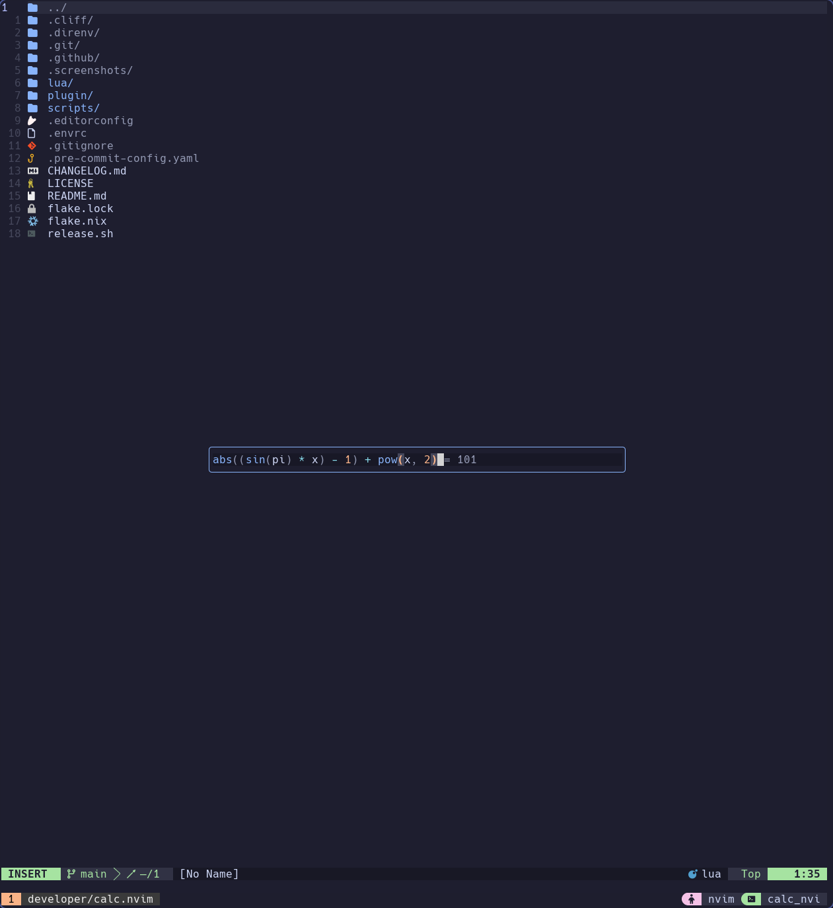
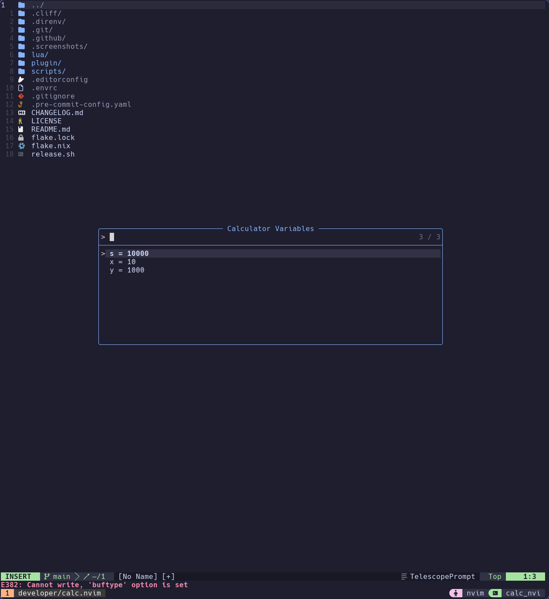
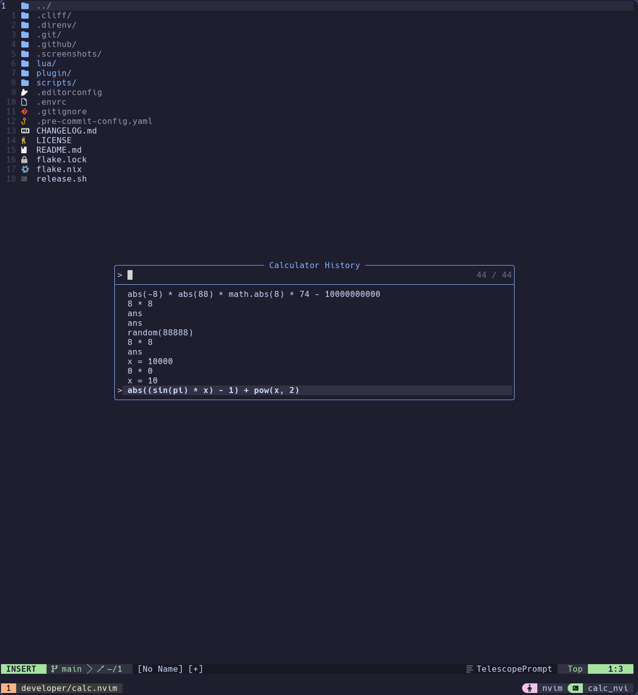

# `calc.nvim`

A minimalist neovim plugin for calculating stuff. You can start editing with `:CalcOpen`.

---

<details>
    <summary>Click to expand screenshots</summary>
    <p align="center">
          
    </p>
    <p align="center">
          
    </p>
    <p align="center">
          
    </p>

</details>

## Setup

Use these key binds to during your calculations.

> [!NOTE]
> Access the last result with `ans`

| Key         | Description                                                    |
| ----------- | -------------------------------------------------------------- |
| `<leader>c` | Open the calculator window                                     |
| `<CR>`      | Commit current input (evaluate assignment or expression)       |
| `<Tab>`     | In Normal mode: cycle forward through history entries          |
| `<S-Tab>`   | In Normal mode: cycle backward through history entries         |
| `<C-c>`     | Close the calculator (in Insert & Normal modes)                |
| `q`         | Close the calculator (in Normal mode)                          |
| `<C-y>`     | Yank the last evaluated result into the unnamed register (`"`) |


Add the following configuration to use `calc.nvim`.

### Installation using [Lazy.nvim](https://github.com/folke/lazy.nvim)

```lua
{
  "flokkq/calc.nvim",
  version = "v0.3.0",
}
```

### Installation using [Packer.nvim](https://github.com/wbthomason/packer.nvim)

```lua
use {
  "flokkq/calc.nvim",
  tag = "v0.3.0",
}
```

### Installation using [vim-plug](https://github.com/junegunn/vim-plug)

```vim
Plug 'flokkq/calc.nvim'
```

